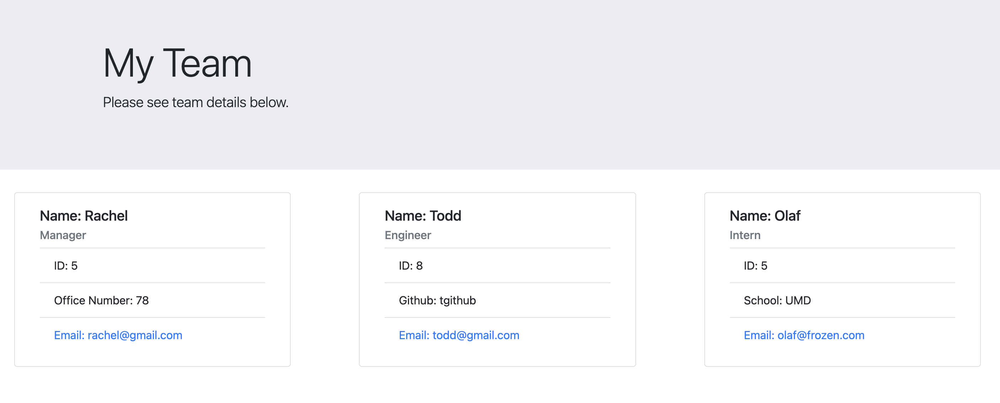

# Team Generator
  

  ## Table of Contents 
  * [Description](#description)
  * [Usage](#usage)
  * [Installation](#installation)
  * [Tests](#tests)
  * [Contributions](#contributions)
  * [License](#license)
  * [Questions](#questions)

  ## Photos
  

  ## Description
  The application allows a user to input members of their team to easily display the team layout. Team member options include manager, engineer, and intern.

  ## Usage
  Please see Screencastify link for instructions on how to use - https://watch.screencastify.com/v/rvnriQbUgYYqK7VLtyrQ

  ## Installation
  Project uses npm package inquirer and jest to run tests.

  ## Tests
  Open terminal in the test folder and then type npm run test. This should activate jest.

  ## Contributions
  Open to all contributions.

  ## License
  This project abides by the - MIT License. To see more information, click on the badge link at the top of the page.

  ## Questions
  Please contact me at rdenton3@terpmail.umd.edu with any further questions. 
  Github link - https://github.com/rdenton3
